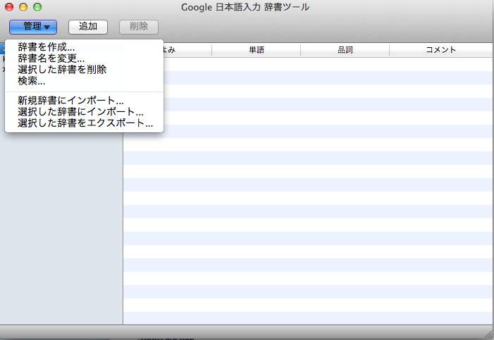

# SQLi辞書

Google 日本語入力用のSQLi辞書。

## インストール方法
Google 日本語入力 辞書ツールを開いて新規辞書にインポートを選択してsqli_dict.txtをインポートする。

## 使い方
全角で s[数字]を打つとsqliが変換候補が出る。

- s１: MySQLへのSQLiチェック
- s２: MySQLから情報を抜くやつ

## LICENCE

"THE BEER-WARE LICENSE" (Revision 42): 

[@tkmru](https://twitter.com/tkmru) wrote this file. As long as you retain this notice you can do whatever you want with this stuff. If we meet some day, and you think this stuff is worth it, you can buy me a beer in return Poul-Henning Kamp